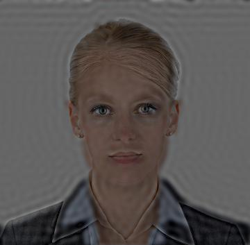

# Hybrid-Images

Hybrid images are images that can be seen from a distance in one form and up close in another. In this project, we implemented an algorithm for making hybrid images using Python.

Image 1:

Image 2:

Hybrid Image (near):

Hybrid Image (far):

